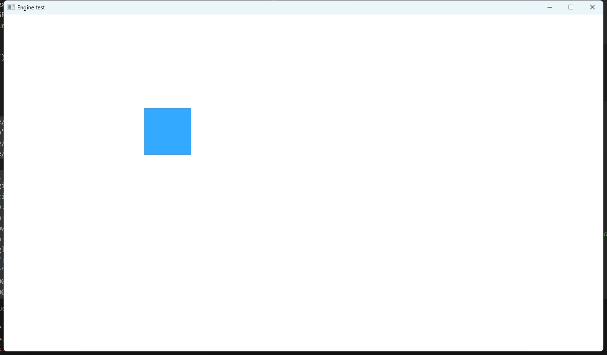
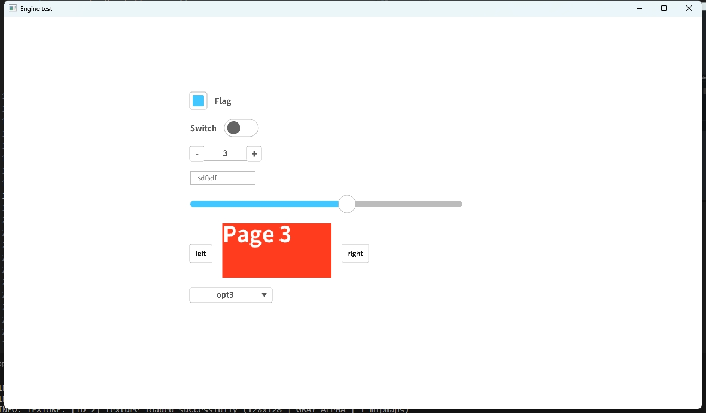
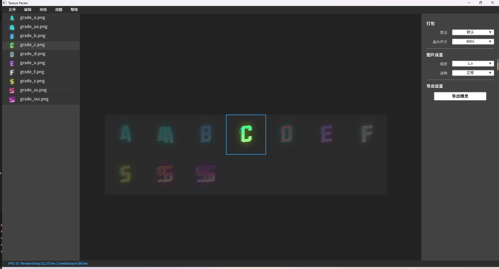
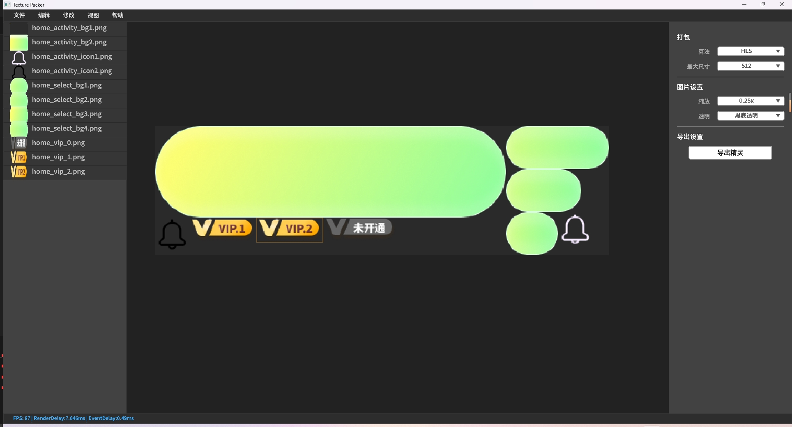
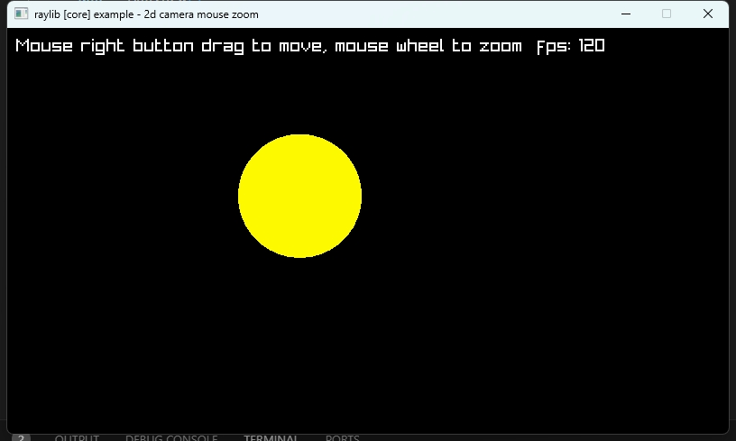
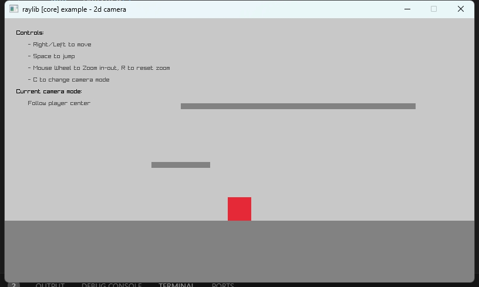
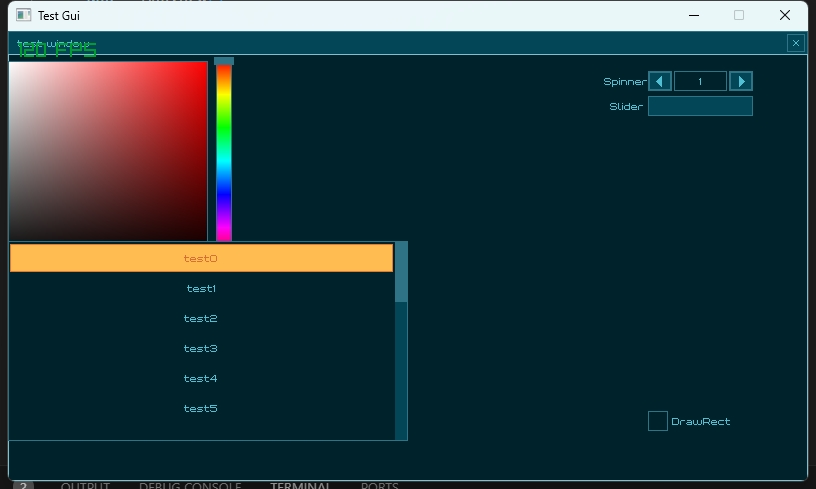
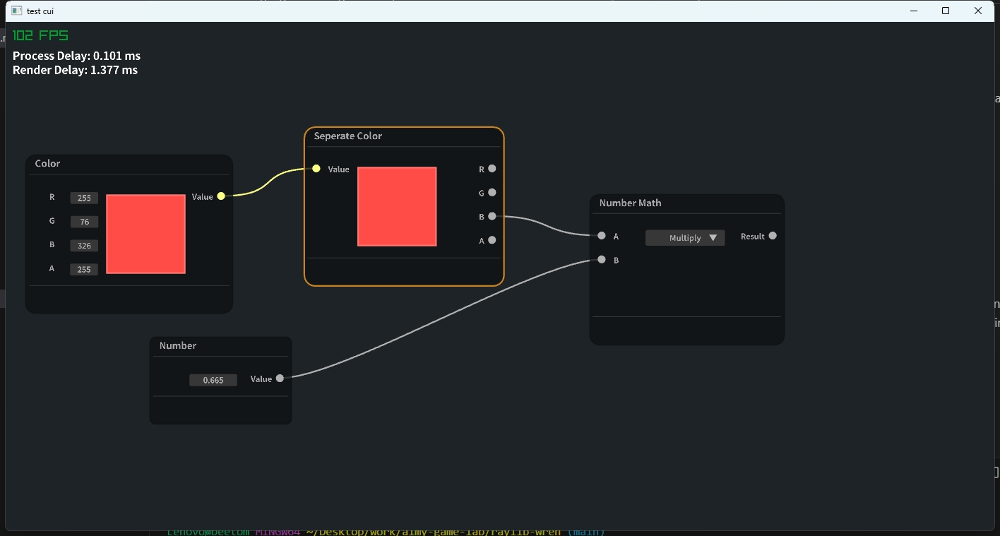
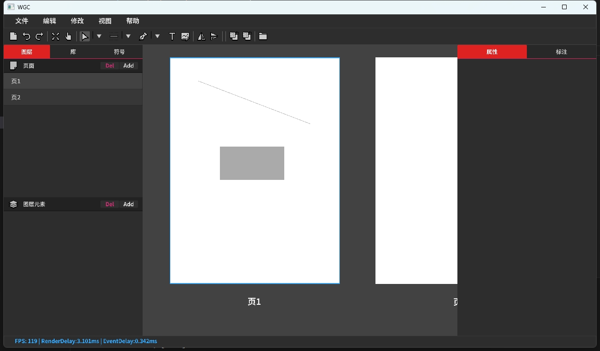

# raylib-wren
wren language binding for raylib.
### [wren language official site](https://wren.io/syntax.html)
I love wren language, it is very handy for working on  many kinds of projects.
### [Raylib official site](https://www.raylib.com/)
### Features 
- Full Raylib API bindings for wren.
- Full Raygui API binding for wren.
- Basic json.hpp bindign for wren.
- Serial API binding for wren.
- File API binding for wren.
- vinput(virtual input enumerating on linux) API binding for wren. (My works on arm/aarch linux device input enumerating for auto test)
- supported languages by default(codepoints)
  - english
  - 日语
  - 韩语
  - 中文简体
  - emoji
- cico/engine
  - sg2d(working on progress)
    - layout
      - row
      - column
      - flow  
    - controls
      - button
      - checkbox
      - combobox
      - fpslabel
      - group
      - inconbutton
      - label
      - listmodel
      - listview (very slow)
      - menubar
      - popup
      - progressbar (todo)
      - scrollbar (todo)
      - scrollview
      - slider
      - spinbox
      - splitview(todo)
      - stackview(todo)
      - statusbar(todo)
      - style
      - swipeview
      - switch
      - tabbar
      - tabview(todo)
      - textfield
      - textinput(todo)
      - toolbar(todo)
      - treeview(todo)
    - icon
    - sprite
    - scenegraph2d
    - rectangle
  - sg3d(working on progress)
  - math
  - app
  - signalslot
  - timer
  - tween
- cico/utils
  - serializer  


### Raylib API Basic Examples

``` wren
import "cico.raylib" for Raylib

Raylib.InitWindow(800, 450, "raylib [core] example - basic window")

while(!Raylib.WindowShouldClose()) {
    Raylib.BeginDrawing() 
      Raylib.ClearBackground(Raylib.RAYWHITE)
      Raylib.DrawText("Congrats! You created your first window!", 190, 200, 20, Raylib.LIGHTGRAY)
    Raylib.EndDrawing()
}

Raylib.CloseWindow()
```

### Using cico api
#### Basic
``` wren
import "cico/engine/app" for App 
import "cico.raylib" for Raylib,Color 
import "cico/engine/sg2d/window" for SgWindow
import "cico/engine/sg2d/rectangle" for SgRectangle
class cico {
    static init() {
        // cico engine initialize
        // create cico app 
        __app = App.new()
        // create a window 
        __mainWIndow = SgWindow.new("Engine test")
        // create a rectangle, an define it's shape with dict(wren Map) 
        var rectangle = SgRectangle.new(__mainWIndow, {
            "width": 100, 
            "height": 100,
            "x": 300,
            "y": 200,
            "color": Color.fromString("#33aaff")
        })
    }

    static eventLoop() {
        // cico engine loop 
        var windowClosed = Raylib.WindowShouldClose()
        __app.loop()
        return windowClosed ? 1 : 0
    }
    static exit() {
        // cico engine exit
        __app.exit()
    }
}
```


#### For advance usage
you can run dist/example/gui/cico_engine_test.wren in the project
``` shell
cd dist
./cico_app.exe example/gui/cico_engine_test.wren 
```


### Gallery

texture packer



core_2d_camera_mouse



core_2d_camera_platformer



raygui



node editor



cico gui 


cico project/wgc




